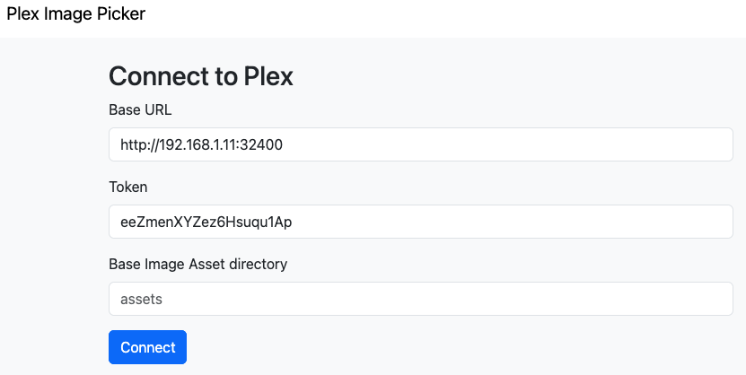
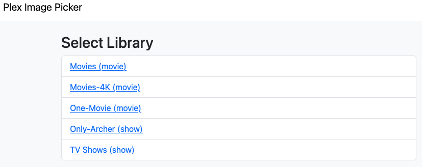
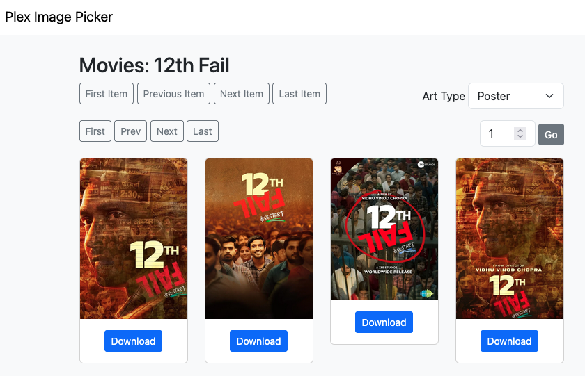
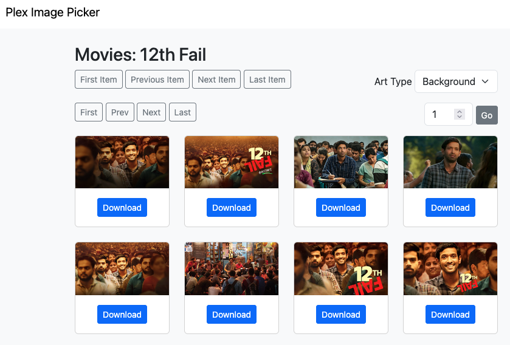
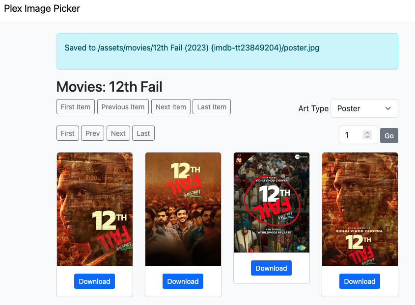
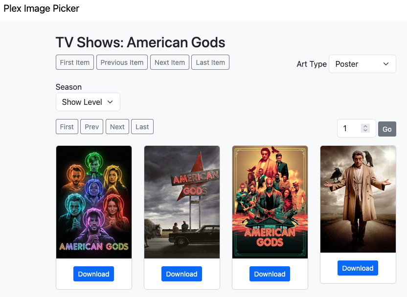
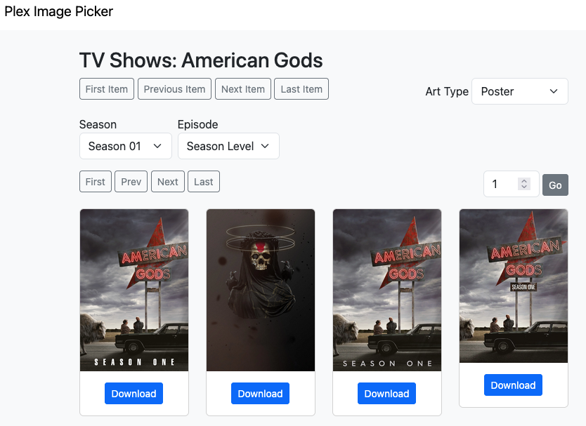
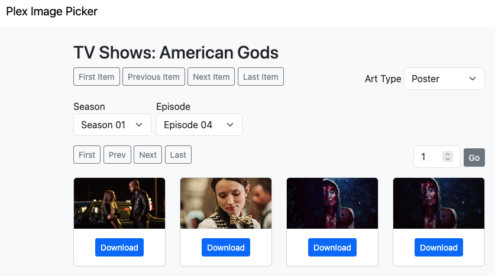

# Plex Image Picker

You want a simple way to choose which Plex-supplied image you want in your asset directory.

This presents a web UI that lets you scroll through the images that plex provides for each item [movie, show, season, episode], selecting the one you want by clicking a button.

When you click on an image, it is downloaded to a file system rooted at `assets` with the correct pathing and naming for the Kometa asset directory.

You can then copy that `assets` directory to the Kometa config dir ready for use.

This script does not use anything from the `.env`, but it does make some assumptions:

## Requirements

1. A system that can run Python 3.7 [or newer]
1. Python 3.7 [or newer] installed on that system

   One of the requirements of these scripts is alive-progress 2.4.1, which requires Python 3.7.
1. A basic knowledge of how to run Python scripts.
1. You can run a web server on the machine that listens on port 5000

## Setup

### if you use [`direnv`](https://github.com/direnv/direnv) and [`pyenv`](https://github.com/pyenv/pyenv):
1. clone the repo
1. cd into the repo dir
1. cd into the app directory [`cd "Plex Image Picker"`]
1. run `direnv allow` as the prompt will tell you to
1. direnv will build the virtual env and keep requirements up to date

### if you don't use [`direnv`](https://github.com/direnv/direnv) and [`pyenv`](https://github.com/pyenv/pyenv):
1. install direnv and pyenv
2. go to the previous section

Ha ha only serious.

To set it up without those things:

#### Python

1. clone repo
   ```
   git clone https://github.com/chazlarson/Media-Scripts.git
   ```
1. cd to repo directory
   ```
   cd Media-Scripts
   ```
1. cd to application directory
   ```
   cd Plex Image Picker
   ```
1. Install requirements with `python3 -m pip install -r requirements.txt` [I'd suggest doing this in a virtual environment]

   Creating a virtual environment is described [here](https://docs.python.org/3/library/venv.html); there's also a step-by-step in the local walkthrough in the Kometa wiki.
1. Run with `flask run`
1. Go to one of the URLs presented.

#### Docker

1. build the docker image:
   ```
   docker build -t plex-image-picker .
   ```
2. run the container:
   ```
   docker run -p 5000:5000 -v /opt/Media-Scripts/plex_art_app/assets:/assets:rw plex-image-picker
   ```
   Change the port and path as needed, of course.
3. Go to one of the URLs presented, as appropriate.

#### Interface

You'll be asked to enter connection details. You can change the directory where the images will go on this initial setup screen:



Then you will choose a library:



You'll see a grid displaying all posters available for the first item in the library:



You can choose to view backgrounds instead of posters:



When you click the Download button, the file will be downloaded to the asset directory; a flash message will report the path:



Click through the movies/shows with the top row of buttons; click through pages of images with the lower set of buttons.

Navigate to a specific page of posters with the dropdown on the right.

Clicking the title in the upper left will take you back to the library list.

In a Show library, you will be able to choose to view posters/backgrounds for shows, seasons, or episodes:




